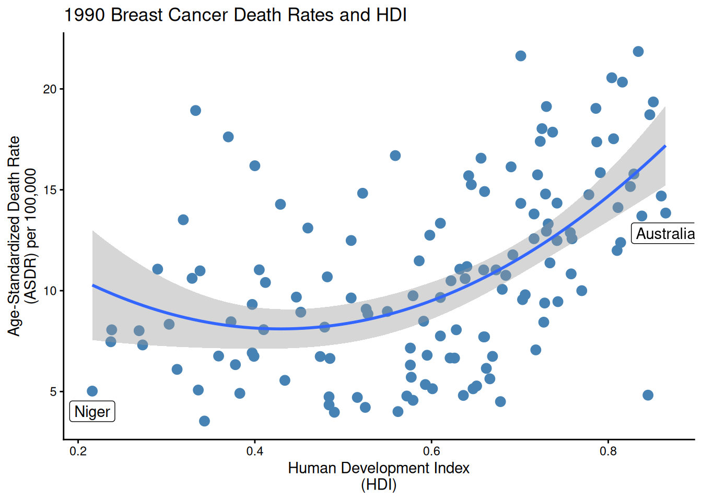
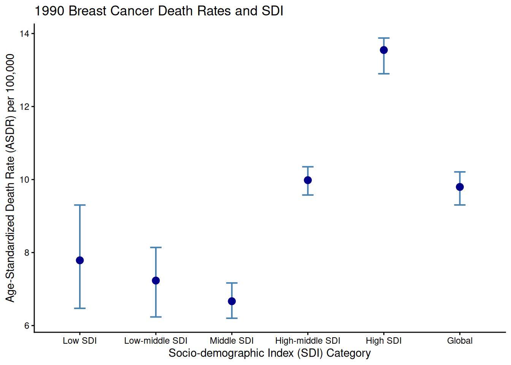

After learning the basics of R these past three days, it is now time to create my own project!

This data set on global trends and forecasts of breast cancer interests me:

<https://www.nature.com/articles/s41597-023-02253-5>

## **#1: Does Human Development Index (HDI) relate to breast cancer mortality rate?**

Prediction: Lower HDI -\> Higher ASDR; Higher HDI -\> Lower ASDR

```{r}

library(readxl)
library(dplyr)
library(ggplot2)

bc_deaths <- readxl::read_excel(path = "/cloud/project/GBD for BC.xlsx", sheet = 1)
bc_hdi <- readxl::read_excel(path = "/cloud/project/GBD for BC.xlsx", sheet = 8)


# Filter down to "Deaths" in the "measure" column
# Filter down to "Rate" in the "metric" column
# Filter down to "1990" in the "year" column 
# Filter down to "Age-standardized" in the "age" column


filtered_data <- bc_deaths |> 
  filter(
    measure == "Deaths",
    metric == "Rate",
    age == "Age-standardized", 
    year == 1990
  )


# Merge datasets by country/location

merged_data <- merge(filtered_data, bc_hdi, by.x = "location", by.y = "Country")

# Sort countries by HDI in ascending order, pulling the first and last rows

extreme_data <- merged_data |> 
  arrange(HDI) |>
  slice(c(1, n()))


# Scatterplot of death rates vs. HDI

ggplot(merged_data, aes(x = HDI, y = val)) + 
  geom_point(color = "steelblue", size = 3) +
  theme_classic() +
  labs(
    title = "1990 Breast Cancer Death Rates and HDI",
    x = "Human Development Index\n(HDI)",
    y = "Age-Standardized Death Rate\n(ASDR) per 100,000"
  ) + geom_smooth(method = "lm", formula = y ~ poly(x, 2)) +
  geom_label(
    data = extreme_data,
    mapping = aes(x = HDI, y = val-1, label = location)
  )


```



## **#2: Does Socio-demographic Index (SDI) relate to breast cancer mortality rate?**

Prediction: Lower SDI -\> Higher ASDR; Higher SDI -\> Lower ASDR

```{r}
library(readxl)
library(dplyr)
library(ggplot2)

bc_region_SDI <- readxl::read_excel(path = "/cloud/project/GBD for BC.xlsx", sheet = 5)


# Filter down to "Deaths" in the "measure" column
# Filter down to "Rate" in the "metric" column
# Filter down to "1990" in the "year" column
# Filter down to "Age-standardized" in the "age" column

filtered_data <- bc_region_SDI |>
  filter(
    measure == "Deaths",
    metric == "Rate",
    age == "Age-standardized", 
    year == "1990"
  )


# Use levels to reorder SDI categories 

filtered_data$location <- factor(
  filtered_data$location, 
  levels = c("Low SDI", "Low-middle SDI", "Middle SDI", "High-middle SDI", "High SDI", "Global")
)

 
class(filtered_data$location)
# Returns as "factor"


# Graph of death rates vs. SDI 

ggplot(filtered_data, aes(x = location, y = val)) + 
  geom_errorbar(
    aes(ymin = lower, ymax = upper), 
    width = 0.15,               
    color = "steelblue", 
    linewidth = 0.7           
  ) + 
  geom_point(color = "darkblue", size = 3) + 
  
  theme_classic() + 
  labs( 
    title = "1990 Breast Cancer Death Rates and SDI", 
    x = "Socio-demographic Index (SDI) Category", 
    y = "Age-Standardized Death Rate (ASDR) per 100,000" 
  )
```


